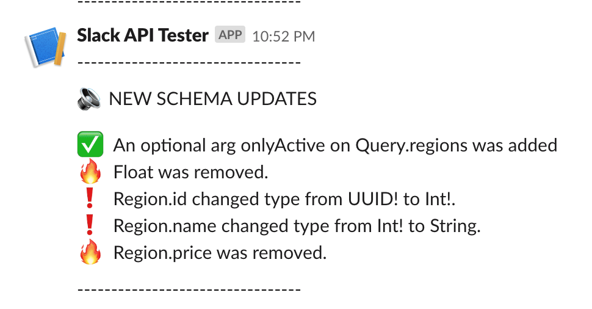

# Schema diff bot

A simple slack bot to send the differences between graphql schemas

# How to use

- install the lib globally or local and be free to configure how to call the bot.

`npm install [-g] schema-diff-bot`

My suggestion is to call the bot using git hook before push new code to the remote repository. I would suggest the usage of [Husky](https://github.com/typicode/husky) to configure git hooks using npm scripts in an easy way.

# config file

schema diff bot uses `cosmiconfig` so, you can create the config file using:

- a package.json property
- a JSON or YAML, extensionless "rc file"
- an "rc file" with the extensions .json, .yaml, .yml, or .js.
- a .config.js CommonJS module

our module is called  `schemaDiffBot` so, you can create:

- a `schemaDiffBot` property in package.json
- a `.schemaDiffBotrc` file in JSON or YAML format
- a `.schemaDiffBotrc.json` file
- a `.schemaDiffBotrc.yaml`, `.schemaDiffBotrc.yml`, or `.schemaDiffBotrc.js` file
- a `schemaDiffBot.config.js` file exporting a JS object

# config options

```
{
  leftSchema: "path to file or url to graphql schema",
  rightSchema: "path to file or url to graphql schema",
  options: {
    //headers to be applied in both schemas
    headers: {
      authorization: "Bearer token",
    },
    //headers to be applied on leftSchema
    leftSchema: {
      headers: {}
    },
    //headers to applied on rightSchema
    rightSchema: {
      headers: {}
    }
  },
  slack: {
    //you should create an slack app e get the token to use web client API
    token: "token",
    //you also should provide channelId
    channelId: "CGU94K7S8"
  },
  icons: {
    //you can change default icons per type of action
    //the actions covered are:

    changed: ":exclamation:",
    removed: ":fire:",
    added: ":white_check_mark:"
  },
  // if true, when has differences the process will stop, useful to run in CI process
  stopProcessIfHasDifferences: "false"
}
```

Example of message received:

